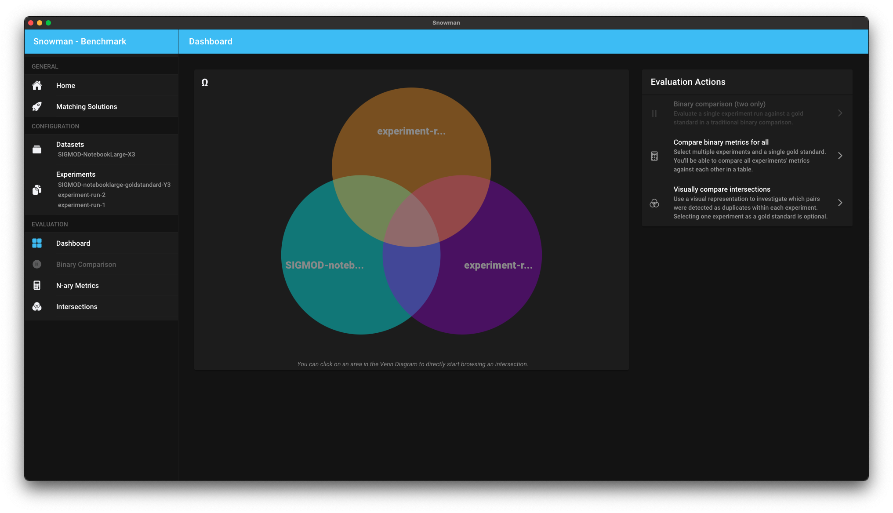

  

<h1 align="center">Snowman</h1>

####   

Comparing data matching algorithms is still an unsolved topic in both industry and research.
With snowman, developers and researchers are able to compare the performance of different data matching solutions or improve new algorithms.
Besides traditional metrics, the tool also considers economic aspects like Soft KPIs.

_This tool is developed as part of a bachelor's project in collaboration with SAP SE._

## Current state

In Q1 and Q2 of 2021, we aim to reach the following milestones:

[x] **Milestone 1:** Ability to add/delete datasets, experiments and matching solutions; binary comparison and basic behavior analysis; executable on all major platform  
[x] **Milestone 2:** Compare more than two experiments and create new experiments based on results; survey Soft KPIs, allow comparison based on KPIs  
[x] **Milestone 3:** Allow individual thresholds for experiments, extend Soft KPIs further and allow advanced evaluation of matching solutions

The precise progress is tracked through Github issues and project boards. Please get in touch in case you want a special feature included :)

_After reaching milestone 3, we plan to continue to work on further features which will broaden the tools abilities and features._

## Contributing

Contribution guidelines will follow soon. Until then, feel free to open an issue to report a bug or request a feature.  
In case you want to contribute code, please first open an associated issue and afterwards a pull request containing the proposed solution.

### Development

See our [development guide](https://hpi-information-systems.github.io/snowman/dev_setup/introduction/) for more information on how to get started.

## Documentation

Please see our documentation for further information: [Snowman Docs](https://hpi-information-systems.github.io/snowman/)

# Licenses

Copyright 2021 Hasso Plattner Institute. Licensed under the [MIT license](./LICENSE).

A complete list of all dependencies and their individual licenses can be found within our documentation.
