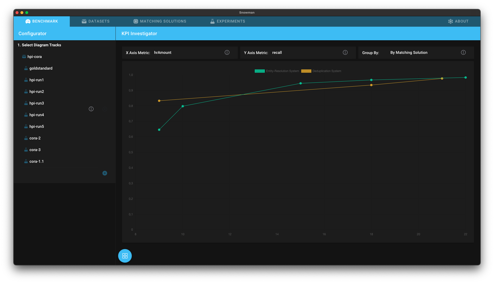

# KPI Investigator

The *KPI Investigator* allows you to contrast accross matching solutions metrics, such as precision, with soft kpis, such as configuration effort.

## Getting Started

1. [Add all matching solutions you want to compare to Snowman](../matching_solutions.md#adding-a-matching-solution)
2. [Add at least one experiment for every matching solution](../experiments.md#adding-an-experiment) and enter the metrics you want to compare
   - add more experiments to improve the evaluation quality
3. Open the [Benchmark Dashboard](../configuring_analyses.md#benchmark-dashboard) and select the analysis *KPI Investigator*.
4. [Select your experiments in the configurator](../configuring_analyses.md#Configurator)
5. You can select the metrics you want to compare from the dropdowns *X Axis Metric* and *Y Axis Metric* at the top of the page.
6. Optionally choose whether to group (and color) the result by matching solution or dataset with the rightmost dropdown.

## Interpreting the Results

In the screenshot above, the x-axis shows the needed hr amount (in person hours) to install a matching solution.
The y-axis shows the recall of specific experiments.
If your specific use case requires a recall of 85% or higher, *Mock Solution* might be better for you as it reaches this precision earlier.
If your goal is to achive the highest possible performance without looking at the effort to get there, *Magellan* might be better as it overtakes *Mock Solution* after 20 hours of configuration.

Many other evaluations are possible.
You can for example measure the difficulity of a dataset by adding experiments of different matching solutions for multiple datasets, grouping by dataset, and then viewing two performance metrics like precision/recall.
