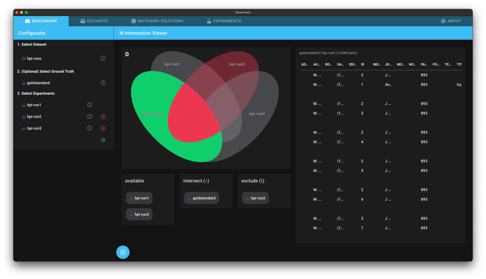

# N-Intersection Viewer

The *N-Intersection Viewer* allows you to investigate which duplicates have (not) been detected by which matching solution.

## Getting Started

1. [Add the benchmark dataset to Snowman](../datasets.md#adding-a-dataset)
2. Optionally [add a gold standard for the dataset to Snowman](../experiments.md#adding-an-experiment)
3. [Add the experiments you want to investigate to Snowman](../experiments.md#adding-an-experiment)
4. Open the [Benchmark Dashboard](../configuring_analyses.md#benchmark-dashboard) and select the analysis *N-Intersection Viewer*.
5. [Select the dataset, optionally the gold standard and your experiments in the configurator](../configuring_analyses.md#Configurator)

## Interpreting the Results

The N-Intersection viewer can for example answer the question which ground truth duplicate pairs have not been found by one or more experiments (a gold standard is not required for this page).
In the screenshot above all pairs are displayed which belong to the goldstandard but not to hpi-run2.
You could now investigate why hpi-run2 does not classify those pairs as duplicates and improve the matching solution accordingly.

Clicking on an area in the Venn diagram intersects all experiments which are present in this area.
By using the drag'n'drop selector below the Venn diagram, other experiments can now be excluded from the intersection.
The example above could therefore be achieved by first clicking on the green area in the picture and then dragging `hpi-run2` from `available` to `exclude`.
