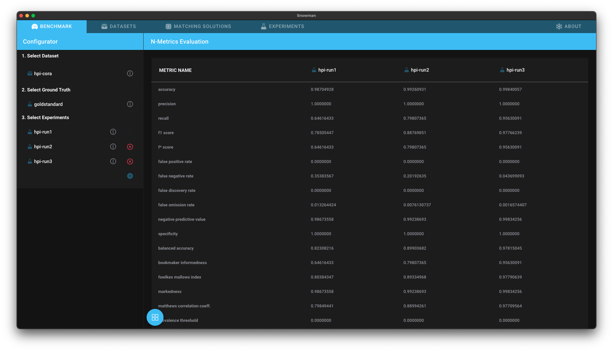

# N-Metrics Table

!!! info
    Requires a gold standard.

The *N-Metrics Table* allows you to compare performance metrics of multiple experiments.

## Getting Started

1. [Add the benchmark dataset to Snowman](../datasets.md#adding-a-dataset)
2. [Add a gold standard for the dataset to Snowman](../experiments.md#adding-an-experiment)
3. [Add the experiments you want to investigate to Snowman](../experiments.md#adding-an-experiment)
4. Open the [Benchmark Dashboard](../configuring_analyses.md#benchmark-dashboard) and select the analysis *N-Metrics Table*.
5. [Select the dataset, the gold standard and your experiments in the configurator](../configuring_analyses.md#Configurator)

## Interpreting the Results

Whenever you want to compare multiple experiments against a single ground truth, you can make use of the N-Metrics Table.
It extends the [Binary Metrics View](#binary-metrics-view) across multiple experiments and presents the result in a table format.

Clicking on an experiment in the header opens the [Binary Metrics View](#binary-metrics-view) for this experiment.
Hover over a metric or a value to see more information.
