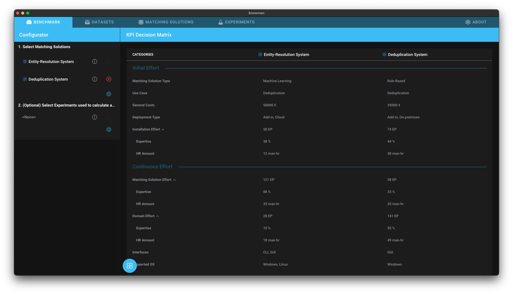
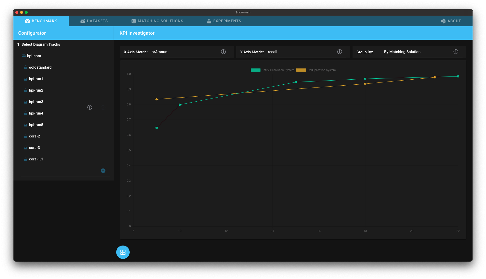

# Overview

| Analysis                                          | Description                                                                                                                                        | Screenshot                                                                   |
| ------------------------------------------------- | -------------------------------------------------------------------------------------------------------------------------------------------------- | ---------------------------------------------------------------------------- |
| [Binary Metrics View](binary_metrics_view.md)     | The *Binary Metrics View* allows you to explore how good an experiment performed by showing it's predictions and performance metrics.              |             |
| [KPI Decision Matrix](kpi_decision_matrix.md)     | The *KPI Decision Matrix* provides you with the most important kpis to make an informed buying decision.                                           |             |
| [KPI Investigator](kpi_investigator.md)           | The *KPI Investigator* allows you to contrast accross matching solutions metrics, such as precision, with soft kpis, such as configuration effort. |              |
| [N-Intersection Viewer](n_intersection_viewer.md) | The *N-Intersection Viewer* allows you to investigate which duplicates have (not) been detected by which matching solution.                        |            |
| [N-Metrics Table](n_metrics_table.md)             | The *N-Metrics Table* allows you to compare performance metrics of multiple experiments.                                                           |                       |
| [Similarity Diagrams](similarity_diagrams.md)     | The *Similarity Diagrams* analysis allows you to find the best similarity threshold.                                                               |  |
