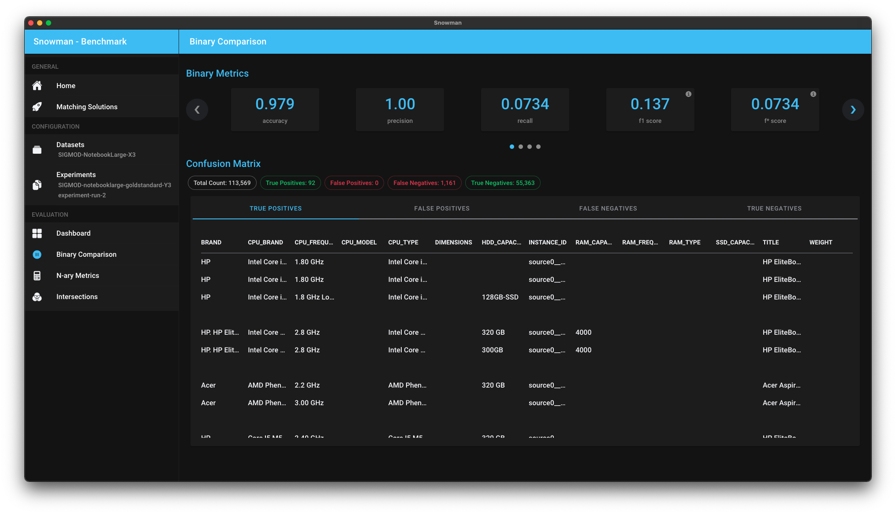

# Benchmark

> This step is currently undergoing larger changes. At the moment, you can only do a binary comparison.

The following benchmarking options are currently available to be used in Snowman:

## Binary Comparison

> For this step, the `1.` experiment is considered to be the gold standard!

After selecting this benchmarking option, binary metrics will be calculated and shown in the top carousel. You can step
through all the available metrics cards and get an overview over the quality of the experiment. Keep in mind that
these metrics are only as reliable as the gold standard is! Some metrics may be unreliable when calculated with a silver
standard - our tool will highlight such metrics if the `1.` experiment was flagged silver standard.

Also, you'll be able to further inspect the experiment's performance by taking a look at the reported false negatives,
false positives and true positives shown in the table below.

**Keep in mind that it may take some time to calculate the results shown on this page!**

## Store a benchmarking setup

It is planned for benchmarking setups to have the option to be saved somewhere for easier comparison. Sadly, this
feature is not yet available and will be part of the larger changes that the whole benchmarking page will undergo.
