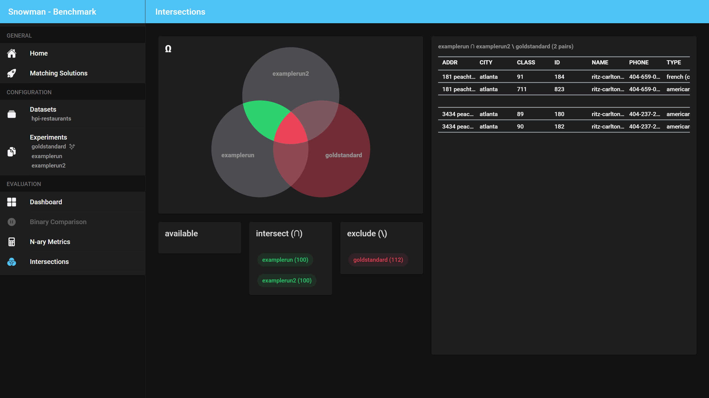

# Benchmark

The following benchmarking options are currently available to be used in Snowman.
You can use the dashboard to choose between each of them.

!!! info
    Some benchmarking options depend on how many experiments and gold standards were selected.

## Dashboard

The dashboard serves as an overview of what is possible with the currently selected experiments (and possibly gold standard). You can click on segments in the Venn Diagram
to investige the selected intersection or use the proposed actions on the right.

**Keep in mind that it may take some time to calculate the results on all evaluation pages.**

## Binary Comparison

_This benchmarking option requires you to select a single gold standard and a single experiment._

For this option, binary metrics will be calculated and shown in the top carousel. You can step
through all the available metrics cards and get an overview over the quality of the experiment. Keep in mind that
these metrics are only as reliable as the gold standard is! Some metrics may be unreliable when calculated with a silver
standard - in the future our tool will highlight such metrics (see [this issue](https://github.com/HPI-Information-Systems/snowman/issues/4)).

Also, you will be able to further inspect the experiment's performance by taking a look at the true positives, false positives, false negatives and true negatives shown in the table below.

## N-ary Metrics

_This benchmarking option requires you to select a single gold standard and at least one experiment._

Whenever you want to compare multiple experiments against a single ground truth, you can make use
of the N-ary Metrics page. It extends the Binary Comparison across multiple experiments and presents
the result in a table format.

Clicking on an experiment title opens the [Binary Comparison page](#binary-comparison) for this experiment.

## Intersections

_This benchmarking option requires you to select one or multiple gold standards or experiments._

This page allows you to browse intersections of experiments. It can for example answer the question which duplicate pairs have been found by two experiments but are not present in the gold standard (a gold standard is not required for this page though).

Clicking on an area in the Venn diagram intersects all experiments which are present in this area. By using the drag'n'drop selector below the Venn diagram, other experiments can now be excluded from the intersection. The example above could therefore be achieved by first clicking on the green area in the picture and then dragging the goldstandard from `available` to `exclude`.
