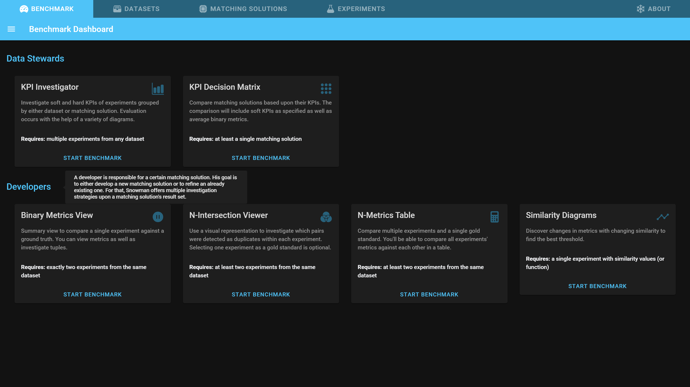
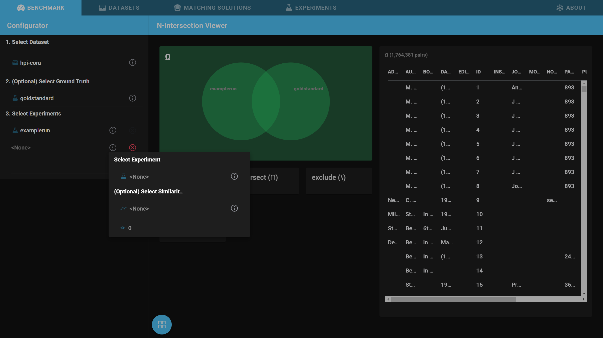
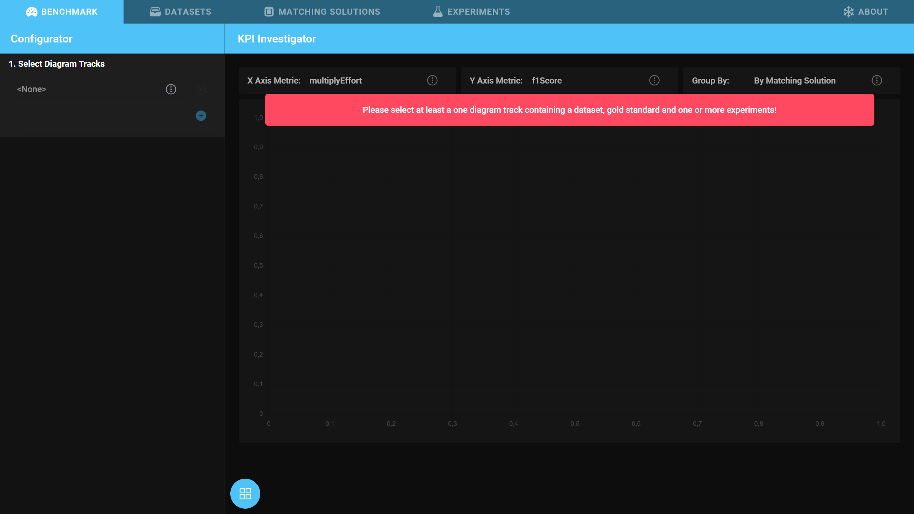

# Configuring Analyses

After reading this page you will know how to configure Snowman for the different analyses.

## Benchmark Dashboard

1. Open the *Benchmark* tab.
   - 
2. You can select the different available analyses by clicking on *Start Benchmark* of the analyses cards.

!!! info
    In many places you can get additional information about objects on the screen by hovering over them. Try hovering over *Data Stewards* or *Developers* on the benchmark dashboard.

## Configurator

After opening an analysis, the subset of experiments, datasets, or matching solutions to be analysed must be selected.
For this we provide a configurator specific to every analysis in the sidebar on the left.

If the configuration for the analysis is not complete, a warning will be shown containing information on how to complete the configuration.

!!! info
    Pro tip: Every entity can be opened and edited by clicking on it's icon.
