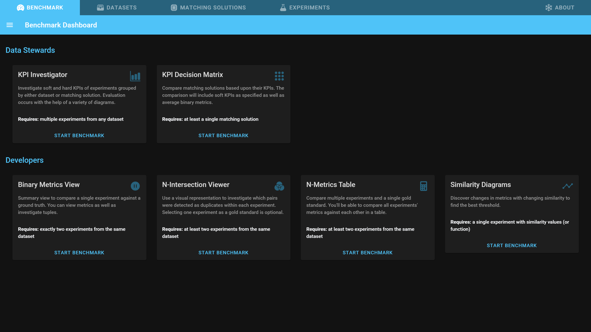

# Configuring Analyses

After reading this page you will know how to configure Snowman for the different analyses.

## Benchmark Dashboard

1. Open the *Benchmark* tab.
   - 
2. You can select the different available analyses by clicking on *Start Benchmark* of the analyses cards.

!!! info
    In many places you can get additional information about objects on the screen by hovering over them. Try hovering over *Data Stewards* or *Developers* on the benchmark dashboard.

## Configurator

After opening an analysis, the subset of experiments, datasets, or matching solutions to be analysed must be selected.
For this we provide a configurator specific to every analysis in the sidebar on the left.

If the configuration for the analysis is not complete, a warning will be shown containing information on how to complete the configuration.

!!! info
    **Pro Tip:** Every entity can be opened and edited by clicking on it's icon.

## Next Step

Now you should know how to configure Snowman for the different analyses.
As a next step we suggest that you take a look at the different analyses you can perform with snowman

- to [compare and find the best matching solution](workflows/comparing_matching_solutions.md)
- or to [improve your matching solution](workflows/improving_matching_solutions.md)

If you are unsure, have a look at [all analyses](analyses/overview.md).
