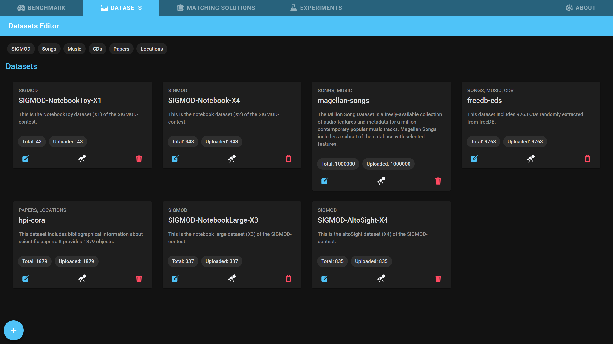
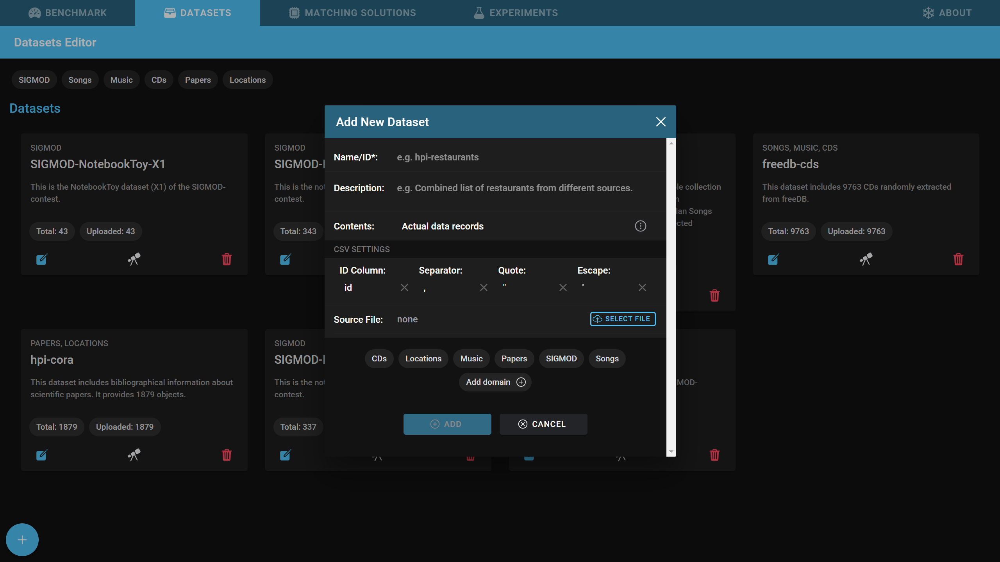
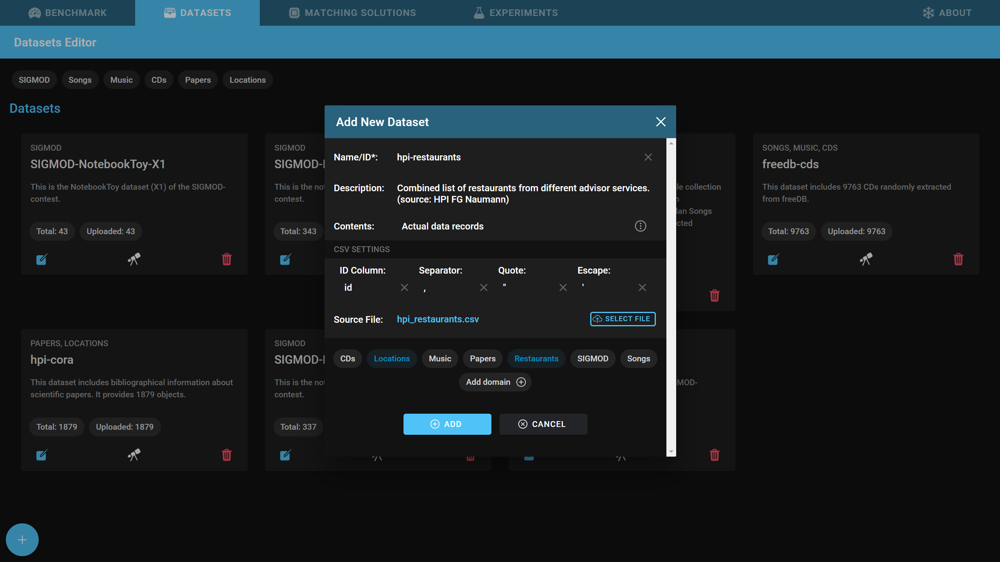
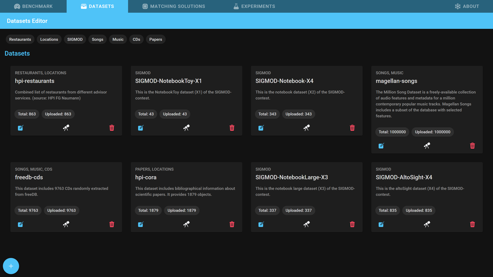
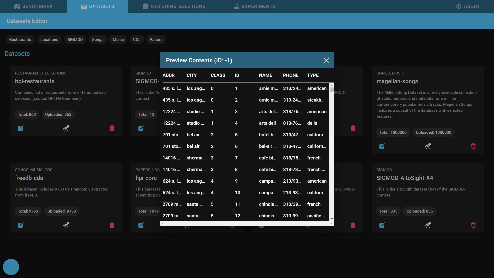
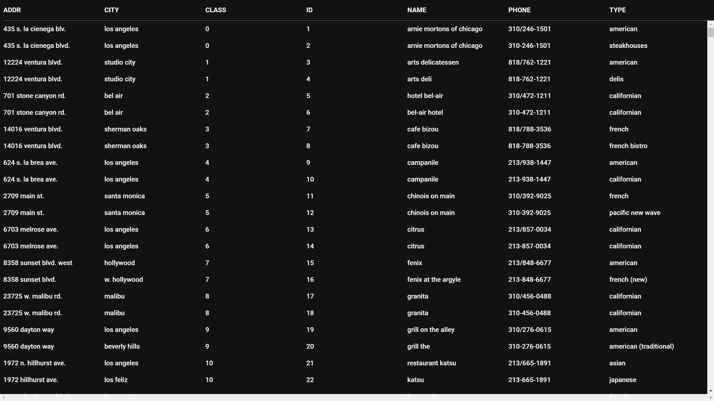

# Datasets

At the end of this tutorial you will know why and how to add your datasets to Snowman. Additionally you will know what you can do with datasets once they are in the tool.

## Adding a dataset

To add and analyse an experiment inside Snowman, you first have to add the dataset which should be deduplicated.

1. Open the *Datasets* tab.
   - 
2. Click on the *+* button in the lower left corner of the screen.
   - 
3. Give the dataset a short name and optionally a comprehensive description. You can also add tags to the dataset at the bottom of the dialog.
4. Select a CSV file containing the dataset and specify the CSV parameters.
   - The ID column contains a unique alphanumeric identifier for every record.
   - 
5. If you do not have access to the dataset records, select *Record count only* as contents and specify the total amount of records in the dataset.
6. Click on *Add* to add the dataset to Snowman.
   - this process can take several minutes depending on the size of the dataset.
7. You should now see your dataset in the Datasets tab
   - 

## Previewing a dataset

You can preview the dataset by clicking on the telescope button on the bottom of the dataset card to make sure that the dataset was added successfully.

- 

!!! info
    **Pro Tip:** Click on the button in the top right corner of any table (which appears when the mouse is over the table) to open the table in a new window.

- 

## Editing a dataset

After the initial dataset creation, you can still change some attributes of the dataset. To open the dataset editor, click the leftmost button on the dataset card.

## Deleting a dataset

To delete a dataset click the rightmost button on the dataset card. **Be aware that all experiments belonging to this dataset will automatically be deleted.**
