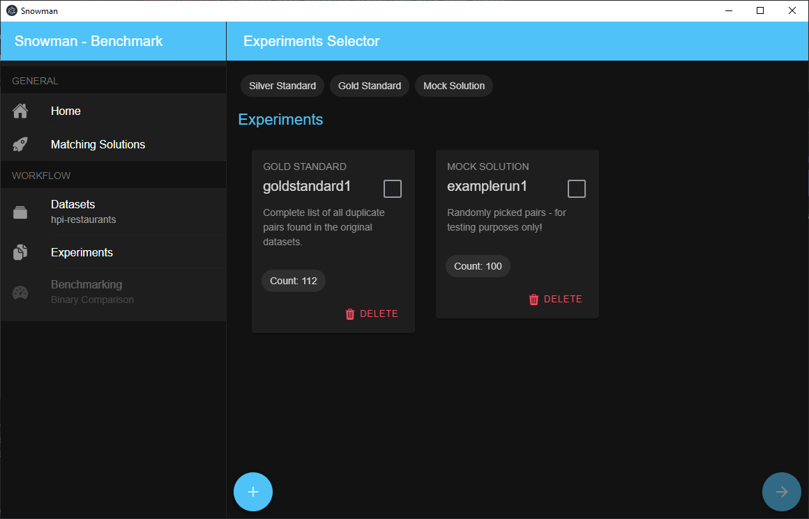

# Experiments

A dataset can consist of multiple experiments. An experiment is thereby considered as a single run of a matching
solution which produces an output set. To ease the workflow, experiments have to be labeled with the matching
solution that was used. The description can contain additional information on how this exact result was achived - e.g.
a list of configuration parameters, or the time spent labeling data.



## Add an experiment

1. Select a dataset.
2. Open page "Experiments" from the sidebar on the left.
3. Add a new experiment with the "+" button in the lower left corner of the screen.
4. Specify a short and concise name, as well as a detailed description.
5. Select a file containing the result set and choose the correct import format. _(see below)_
6. Click on "Add experiment" - this process may take several minutes to complete as indexes have to be created!

### Upload failed

Since creating the experiment and uploading its contents are two separate steps, you may receive an error message stating
that the file upload failed. In this case, the experiment itself was created (most likely) empty with no pairs.
In this case, simply delete the experiment and start over again.

## Selecting experiments

You can select experiments to use for the further workflow steps by clicking on the gray square of each experiment card.
Within the side menu on the left, you can then see the order in which the experiments will be used.

> For now, you'll have to select the experiment used as a **gold standard** in the following steps with `1.` - this is compulsory!

## Import formats

To ease the import process, Snowman understands several file formats out of the box. Those include:

### Pilot

This file format was introduced with the initial prototype and is the easiest available format.

Result sets can be uploaded as (comma-separated) csv files in **UTF-8** encoding. We expect the csv file to have `,`
as split character, `"` as quote character and `'` as escape character.

The importer expects the csv to have the columns `p1` and `p2`. They should store the ids of the respective
dataset tuples.

The csv optionally can have a column named "prediction" which contains a `1` in case the pair was detected as duplicate -
`0` otherwise. If this column is not present we assume that all listed tuples have been detected as duplicates
(think: we automatically insert a column "prediction" and fill it with the value `1` everywhere).

Following this, more columns may be specified with arbitrary content. See the following example:

```csv
p1,p2,prediction,feat1,feat2,feat3,sum
2,1,1,0.3,0.4,0.4,2
1,2,1,0.3,0.4,0.4,2
4,3,1,0.3,0.4,0.4,2
3,4,1,0.3,0.4,0.4,3
6,5,1,0.3,0.5,0.4,3
5,6,1,0.3,0.5,0.4,3
8,7,1,0.3,0.5,0.4,2
7,8,1,0.3,0.5,0.4,2
10,9,1,0.3,0.5,0.4,2
9,10,1,0.3,0.4,0.4,2
12,11,1,0.3,0.4,0.4,2
11,12,1,0.3,0.4,0.4,8
14,13,1,0.3,0.4,0.4,8
13,14,1,0.3,0.4,0.4,8
16,15,1,0.3,0.4,0.4,8
15,16,1,0.3,0.4,0.4,2
...
```

### Magellan

The open-source matching solution Magellan is widely used in research. We support its result set file format out of the box.

```csv
,_id,ltable_id,rtable_id,id_id_exm,id_id_anm,id_id_lev_dist,id_id_lev_sim,name_name_jac_qgm_3_qgm_3,name_name_cos_dlm_dc0_dlm_dc0,name_name_jac_dlm_dc0_dlm_dc0,name_name_mel,name_name_lev_dist,name_name_lev_sim,name_name_nmw,name_name_sw,addr_addr_jac_qgm_3_qgm_3,addr_addr_cos_dlm_dc0_dlm_dc0,addr_addr_jac_dlm_dc0_dlm_dc0,addr_addr_mel,addr_addr_lev_dist,addr_addr_lev_sim,addr_addr_nmw,addr_addr_sw,city_city_jac_qgm_3_qgm_3,city_city_cos_dlm_dc0_dlm_dc0,city_city_jac_dlm_dc0_dlm_dc0,city_city_mel,city_city_lev_dist,city_city_lev_sim,city_city_nmw,city_city_sw,type_type_jac_qgm_3_qgm_3,type_type_cos_dlm_dc0_dlm_dc0,type_type_jac_dlm_dc0_dlm_dc0,type_type_mel,type_type_lev_dist,type_type_lev_sim,type_type_nmw,type_type_sw,gold,predicted
124,2054,598,283,0,0.47324414715719065,3,0.0,1.0,1.0,1.0,1.0,0.0,1.0,11.0,11.0,0.21739130434782608,0.40824829046386296,0.2222222222222222,0.7647619247436523,30.0,0.25,-16.0,9.0,0.47058823529411764,0.8164965809277259,0.6666666666666666,0.9230769276618958,5.0,0.6153846153846154,3.0,8.0,0.0,0.0,0.0,0.4991452991962433,11.0,0.15384615384615385,-6.0,1.0,1,1
54,768,739,115,0,0.15561569688768606,3,0.0,0.1111111111111111,0.40824829046386296,0.25,0.5292929410934448,12.0,0.19999999999999996,-1.0,4.0,0.14814814814814814,0.2886751345948129,0.16666666666666666,0.5842490792274475,9.0,0.3571428571428571,4.0,4.0,0.47058823529411764,0.8164965809277259,0.6666666666666666,0.9230769276618958,5.0,0.6153846153846154,3.0,8.0,0.0,0.0,0.0,0.0,6.0,0.0,-2.0,1.0,0,0
268,1736,1046,246,0,0.23518164435946465,2,0.5,0.058823529411764705,0.33333333333333337,0.2,0.5309057235717773,15.0,0.11764705882352944,0.0,4.0,0.06896551724137931,0.0,0.0,0.6170329451560974,10.0,0.2857142857142857,3.0,4.0,0.0,0.0,0.0,0.5897436141967773,10.0,0.23076923076923073,2.0,3.0,0.3,0.7071067811865475,0.5,0.875,10.0,0.375,-4.0,6.0,0,0
293,618,888,78,0,0.08783783783783783,2,0.33333333333333337,0.2,0.4999999999999999,0.3333333333333333,0.6702020168304443,9.0,0.4,2.0,5.0,0.10810810810810811,0.22360679774997896,0.125,0.510185182094574,17.0,0.29166666666666663,-2.0,6.0,0.47058823529411764,0.8164965809277259,0.6666666666666666,0.9230769276618958,5.0,0.6153846153846154,3.0,8.0,0.0,0.0,0.0,0.5777778029441833,6.0,0.0,-1.0,1.0,0,0
230,486,866,66,0,0.07621247113163976,1,0.6666666666666667,0.18181818181818182,0.35355339059327373,0.2,0.35333332419395447,18.0,0.28,-8.0,6.0,0.02857142857142857,0.0,0.0,0.4783068895339966,14.0,0.2222222222222222,0.0,2.0,0.0,0.0,0.0,0.4611110985279083,13.0,0.1333333333333333,-5.0,1.0,0.0,0.0,0.0,0.5138888955116272,7.0,0.125,-2.0,2.0,0,0
134,2079,599,284,0,0.4741235392320534,3,0.0,1.0,1.0,1.0,1.0,0.0,1.0,17.0,17.0,1.0,1.0,1.0,1.0,0.0,1.0,14.0,14.0,0.47058823529411764,0.8164965809277259,0.6666666666666666,0.9230769276618958,5.0,0.6153846153846154,3.0,8.0,0.4444444444444444,0.7071067811865475,0.5,0.9142857193946838,6.0,0.5714285714285714,2.0,8.0,1,1
12,391,905,48,0,0.053038674033149213,3,0.0,0.19230769230769232,0.40824829046386296,0.25,0.6499999761581421,9.0,0.4,3.0,6.0,0.023809523809523808,0.0,0.0,0.47883597016334534,18.0,0.1428571428571429,0.0,2.0,0.0,0.0,0.0,0.5416666865348816,9.0,0.25,-1.0,3.0,0.4444444444444444,0.7071067811865475,0.5,0.7321428656578064,6.0,0.5714285714285714,2.0,8.0,0,0
423,1450,758,209,0,0.2757255936675461,3,0.0,0.21875,0.35355339059327373,0.2,0.5888888835906982,12.0,0.4,3.0,7.0,0.07692307692307693,0.0,0.0,0.5629629492759705,11.0,0.2666666666666667,-2.0,4.0,0.0,0.0,0.0,0.5352563858032227,12.0,0.07692307692307687,-4.0,2.0,0.0,0.0,0.0,0.4833333194255829,8.0,0.19999999999999996,0.0,2.0,0,0
272,248,797,33,0,0.04140526976160597,3,0.0,0.20833333333333334,0.40824829046386296,0.25,0.6168830990791321,8.0,0.4285714285714286,3.0,6.0,0.2,0.5,0.3333333333333333,0.7516340017318726,9.0,0.47058823529411764,6.0,7.0,0.0,0.0,0.0,0.0,8.0,0.0,-6.0,0.0,1.0,1.0,1.0,1.0,0.0,1.0,8.0,8.0,0,0
...
```

### Sigmod2021

See [here](https://dbgroup.ing.unimore.it/sigmod21contest/task.shtml).

### ClusterER

This is an internal file format.
