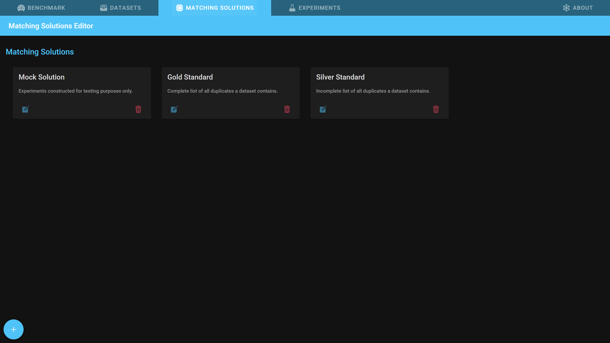
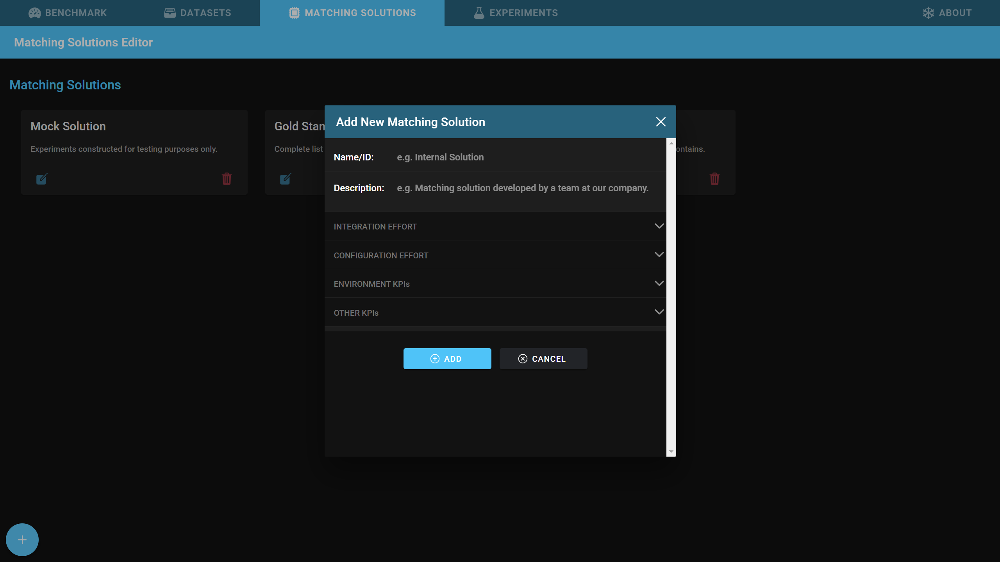
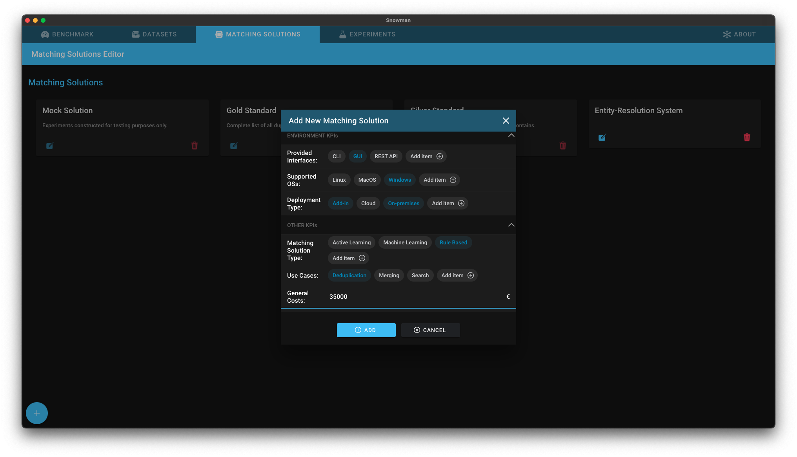

# Matching Solutions

After reading this document you will know how to add your matching solution to Snowman. Further you will know what you can do with matching solutions in the tool.

## Adding a matching solution

1. Open the tab *Matching Solutions*.
   - 
2. Click on the *+* button in the lower left corner of the screen.
   - 
3. Specify a short name and optionally a comprehensive description.
4. Optionally, open the other sections to fill in more details about the matching solution.
   - 
5. Click on *Add*

## Deleting a matching solution

If a solution was created by accident or is not required anymore, you can delete it by clicking on the rightmost button of the matching solution card. **Be aware that all experiments belonging to this matching solution will automatically be deleted.**
