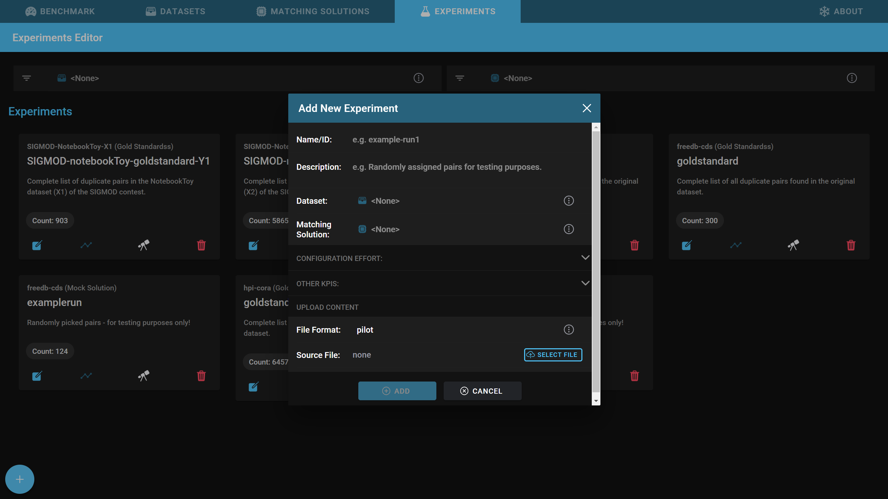

# Comparing matching solutions

Comparing matching solutions and selecting the best one for a specfifc use case is a difficult task. Many different factors influence the decision. Mainly they can be grouped by the following:

1. **The general performance** of a matching solution, measured with metrics, such as "precision" or "recall"
2. **The effort to configure a matching solution**, measured with metrics, such as the "time to configure" or "total cost of ownership"
Snowman supports the user in comparing multiple matching solutions. For that Snowman provides an overview matrix with the most important kpis which helps to make a decision.

## KPI-Decision-Matrix

First of all you have to create a new matching solution:

Then click on the tab "Benchmark" and select the action "KPI Decision Matrix".

You are now able to compare and to select the best matching solution based on the offered KPIs.

Explanation of each KPI:

| KPI                       | Definition                                                                                                      |
| --------------------------| --------------------------------------------------------------------------------------------------------------- |
| Matching Solution Type    | The architectural type of the matching solution, such as "Machine Learning", "rule-based" or "Active Learning"  |
| Use Case                  | Which use cases does the matching solution cover (e.g., merging from two file, deduplicating one file, ...)? Some matching solutions do not support every use case.                                                                                                      |
| General Costs             | These include the cost to buy a matchingsolution, the cost to host the infrastructure, etc.. Since thesecan vary from payment model to payment model (one-timecosts, monthly costs, pay-per-use), they are aggregated overthe entire product lifecycle to increase comparability. Sincethese can vary from payment model to payment model (one-time costs, monthly costs, pay-per-use), they are aggregatedover the entire product lifecycle to increase comparability.                                                                                                  |
| Deployment Type           | This describes in which way the matching solution has to be deployed: Does a hosted instance exist already? Or is it just locally executable? Hosted instances,for example, often require less maintenance and might be therefore a decision criteria.                  |
| Installation Effort       | Embedding a matching solution in the software landscape of a company requires a specific knowledge level and amount of time which varies for each matching solution. The integration effort is split into these kpis.                                                |
| Matching Solution Effort  | Another task is configuring the matching solution itself. Some matching solutions do not require any specific knowledge (for example, solutions where uploading only a file is sufficient), but other matching solution need detailed configurations. Because of that, we propose to measure the effort to configure a matching solution by knowledge-level and HR-Amount.               |
| Domain Effort             | Matching solutions often require domain knowledge during the configuration phase: A machine learning based approach, for example, needs pre-labeled data to fit the model. For that, a person who knows the domain has to classify given pairs of records, in order to create a trainings dataset. For rule-based approaches domain knowledge is needed, too: Rules have to be created, based on pair-wise similarities. To define effective rules, it requires domain knowledge. This results in a domain effort for the specific matching solution, measured by the required expertise and HR-Amount.                |
| Interfaces                | This describes the provided interfaces to access the matching solution (e.g.: GUI, API, CLI). Depending on the use case it might be necessary that the matching solution provides a specific interface: For example, the automation of specific data matching tasks requires an API or CLI.                |
| Supported OS              | On which operating systems is it possible to execute the data matching solution?                |

!!! info
    **knowledge-level** and **hr-Amount** are mutually dependent. A person with a higher knowledge-level does usually need less time to configure a specific matching solution. To reflect this issue, we provide an aggregated measure. This is calculated with the [manhattan-distance](https://en.wikipedia.org/wiki/Taxicab_geometry) between the **knowledge-level** and the **hr-Amount**

## KPI Investigator

Next to the [KPI Decision Matrix](comparing_matchingsolutions.md#kpi-decision-matrix) Snowman allows the comparison of multiple matching solutions with the **KPI Investigator** based on performance metrics, such as precision or recall, and on soft metrics, such as configuration effort. This enables evaluations, such as the comparison of multiple matching solutions based on the recall in dependency to the effort spent to configure the matching solution.

First of all, you have to upload at least one experiment and enter metrics, such as the needed **matching solution knowledge level** (How much knowledge is needed to configure the experiment to get the results from the experiment?) or the **hr-Amount** (how much time is spent to configure the matching solution?).

You can then select the tab "Benchmark" and click on "KPI Investigator".

Finally, you have to select the correct experiment on the left hand side and then select a kpi for the x- and y-axis each.

In this example, the x-axis shows the needed hr amount (in person hours) to install a matching solution.
The y-axis shows the recall of specific runs of the matching solution (from now on called experiments).
