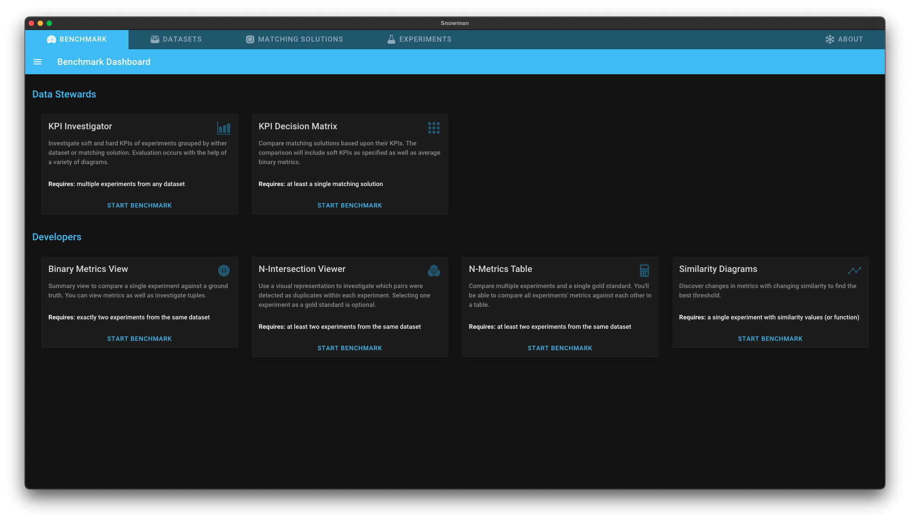
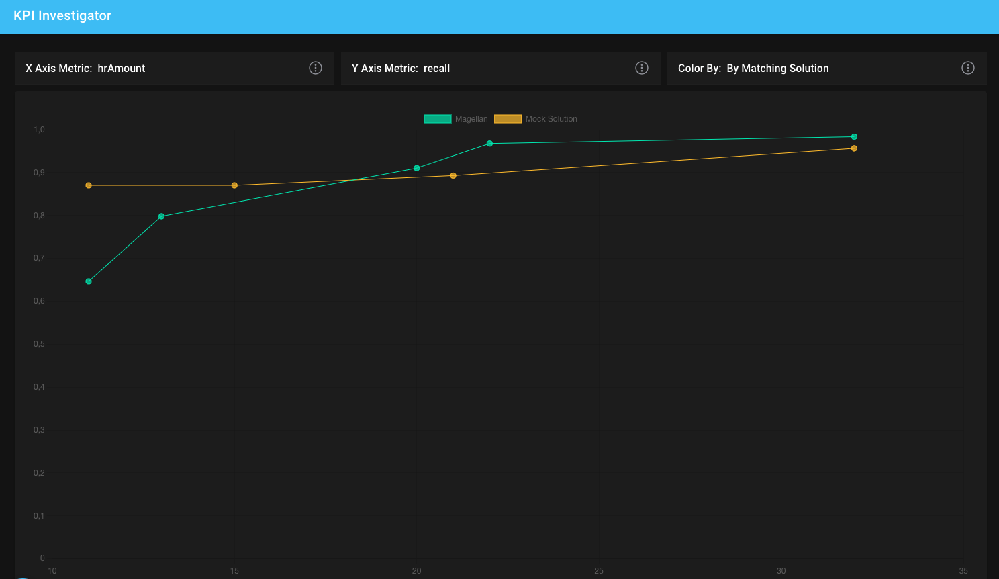
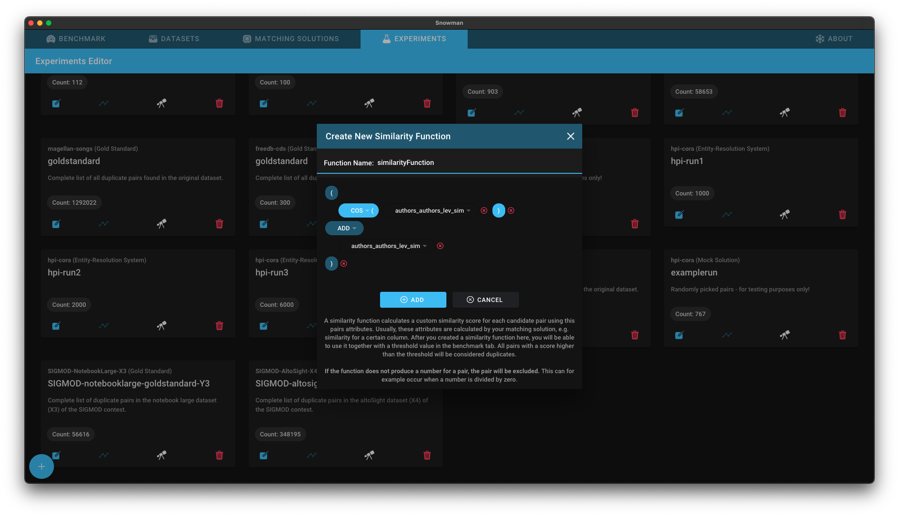
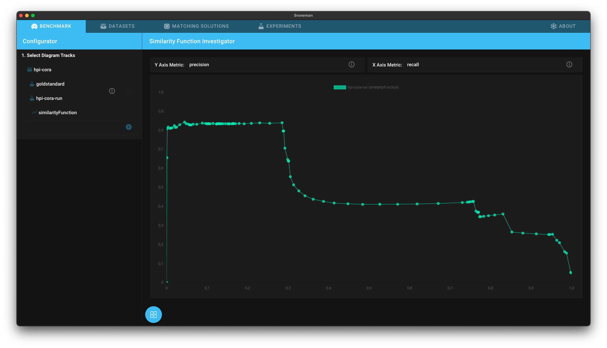

# Showcase

Snowman app supports multiple analysis and benchmark workflows. This page showcases those workflows.

## Finding the best matching solution for your use case

Let's assume you are a data steward for a company and you have to buy a data matching solution. For that you focus on two specific matching solutions:

* Magellan
* Mock Solution

When selecting a specfic matching solution data stewards have to take into account many different factors. A matching solution is not only characterized by its performance but also by the effort needed to configure it.

Snowman provides an overview matrix with the most important kpis which helps to make a decision.

First of all you have to create a new matching solution:

Then click on the tab "Benchmark" and select the action "KPI Decision Matrix".

You are now able to compare and to select the best matching solution based on the offered KPIs.

Let us assume that any matching solution must achive a minimum recall of 85% on a test dataset to be considered.
Snowman allows you to track how much time was used to achive specific results.
It analyses this data and presents the results in the "KPI Investigator".
The KPI Investigator allows to compare multiple matching solutions based on performance metrics, such as precision or recall, and on soft metrics, such as configuration effort.

In this example, the x-axis shows the needed hr amount (in person hours) to install a matching solution.
The y-axis shows the recall of specific runs of the matching solution (from now on called experiments).
Mock Solution (the matching solution visualized with the orange line) reaches a recall of 85% earlier than the other matching solution!

## Improving the performance of your matching solution

Let us assume that you have bought a specfic matching solution.
The next goal is to configure the matching solution for your specific use case.
To support this process Snowman provides different analysis views:

You can intersect multiple experiments of the same or different matching solutions to see which tuples are detected by which experiment.

In this example all pairs are displayed which belong to the goldstandard but not to hpi-run2. You could now investigate why hpi-run2 does not classify those pairs as duplicates and improve the matching solution accordingly.

Furthermore it is possible to evaluate the experiments based on metrics like precision or recall:

If you want to investigate the behavior of one experiment more detailed you are able to explore the false positives, true positives, false negatives, and true negatives:

If your matching solution outputs a relevance score or similarity values next to the matching decision, Snowman can be used to find the best threshold for your use case.
**Note that only pairs outputted by the matching solution are considered. Snowman does not calculate similarities or relevance scores itself.**

First, you have to define the function which was used by the matching solution for making matching decisions.

Then you are able to find the best threshold using precision-recall graphs (or any other metric-metric graphs).

