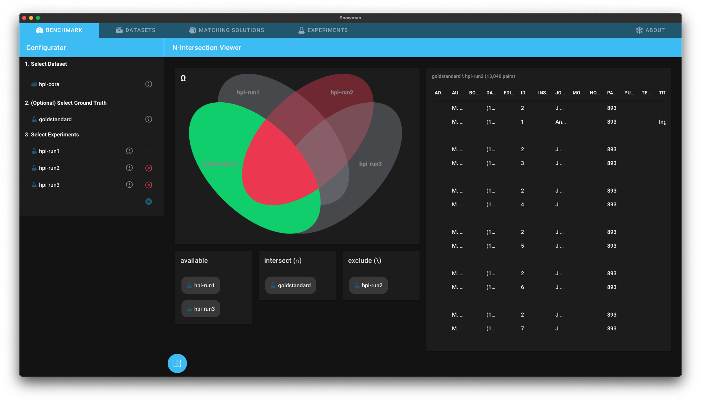

# Showcase

Snowman app supports multiple analysis and benchmark workflows. This page contains a presentation of basic showcases on how to use the data matching benchmark.

### Finding the best matching solution for your use case

Let's assume you are a data steward for a company and you have to buy a data matching solution. For that you focus on two specific matching solutions:

* Magellan
* Mock Solution

When selecting a specfic matching solution data stewards have to take into account many different factors. A matching solution is not only characterized by its performance but also by the needed effort to configure the specific matching solution.

Snowman now delivers an overview matrix with the most important kpis which helps to make a decision.

First of all you have to create a new matching solution:

Then click on the tab "Benchmark" and select the action "KPI Decision Matrix".

You are now able to compare and to select the best matching solution based on the offered KPIs.

Let's assume that you are still unsure which matching solution you want to buy. It might be relevant to see for which matching solution you need the less configuration effort to reach a recall of 85%. For that we propose using the "KPI Investigator". This allows to compare multiple matching solutions based on different metrics: On Performance-metrics like precision or recall and on softKPI-metrics like configurationEffort.
Let's have a look at the two matching solutions below. You can see on the x-axis the needed hrAmount to install a matching solution and on the y-axis the recall of specific runs of the matching solution. The matching solution visualised with an orange line reaches a recall-value of 85% earlier than the other matching solution!

### Analysing one matching solution

Let's assume that you have now bought a specfic matching solution. The next goal is to configure the matching solution for your specific use case. For that snowman provides different analysis views:
You can intersect a run of a matching solution with other runs of the matching solution and see which tuples are detected by which matching solution.

Furthermore it is possible to evaluate the experiment runs based on metrics like precision or recall:

If you want to investigate the behavior of one experiment more detailed you are able to explore the false positive, true positive, false negative and true negative:

Snowman allows the exploration of the behavior of a dataset with similarity functions.
For that you can create new similarity functions with the similarity function builder.

You are then able to find the best similarity threshold of a data matching solution using precision-recall-graphs!

